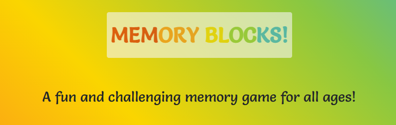
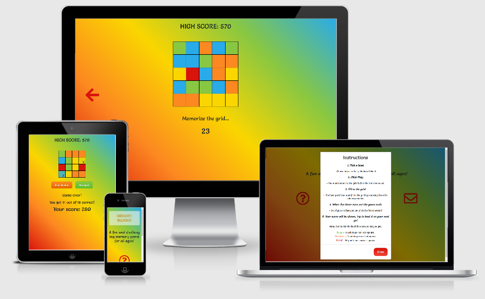
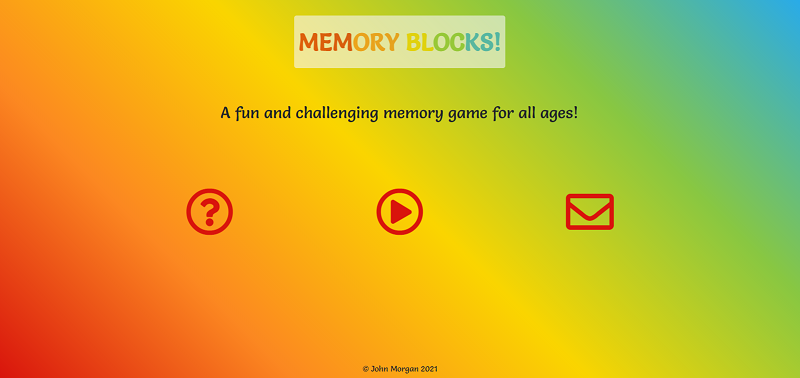
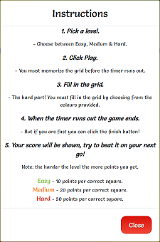
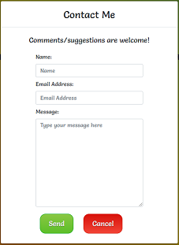
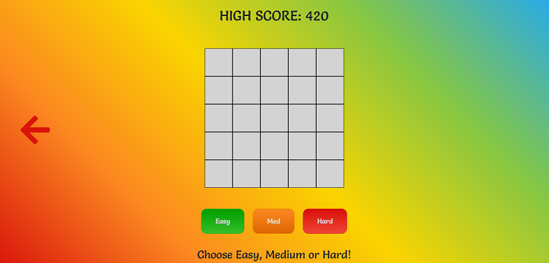
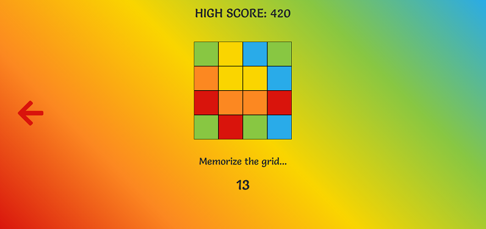
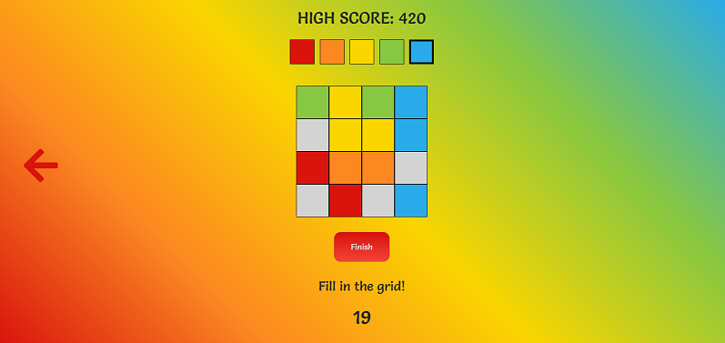
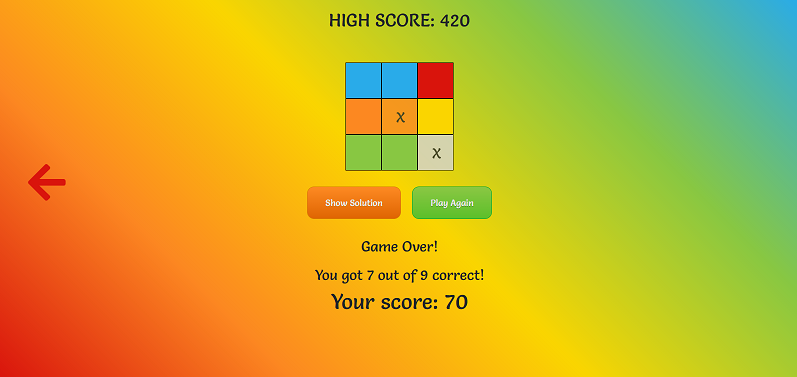

    
    <h2>
        Memory Blocks is an entertaining and challenging memory game that is suitable for all ages, 
        it can be played by anyone that can use a phone or any personal computing device!
    </h2>
    <h3><a href="https://johnny-morgan.github.io/memory-blocks/" target="_blank">Click here</a> to view the site on GitHub pages.</h3>

## Overview

The fundamental objective of this website is to provide an engaging and stimulating memory game that is suitable for everyone.

Business Goals

  - Create a challenging game

    - Memory Blocks challenges the player to remember a grid made up of between 9 and 25 squares depending on the level of difficulty. 
    Each square has a colour that the player must remember under a certain time limit. They must then reproduce the grid from memory before a 
    second timer reaches zero. Remembering a large amount under a time constraint is an exceptionaly challenging task.

  - Provide a cognitively stimulating experience

    - Short-term memory is key to playing Memory Blocks and playing often will improve function in this area. Playing this game can improve 
    other brain functions, such as attention, concentration, and focus. 

  - A game that appeals to all ages

    - The uncomplicated gameplay of Memory Blocks ensures that it is a game that can be played by everyone. Improving your memory is a skill 
    that everyone can develop.

Player goals

  - An fun and exciting game to play

    - The countdown timer introduces an element of tension 

  - An easy to navigate website, especially important for young players

    - The website consists of two pages, the home page and the game page. Large icons on the home page can be clicked that provide players with 
    instructions on how to play the game and an option to contact the developer. The game page contains large and colourful buttons and icons to 
    return to the home page.

## User Experience (UX) 

- ### User Stories

    As a player, I want:
 
    1. A game that will help sharpen my memory, so I can boost my memory performance in other areas of my life.
    2. A game that that has different levels of difficulty, so I can continue to challenge myself as my memory skills improve.
    3. To be able to keep track of my high score, so I can challenge myself to beat it.
    4. A game that I can play on all devices, so I can play it at any time or place.
 
    As a young player, I want:

    1. A game that is simple and intuitive to play, so I do not need to spend too much time learning how to play the game.
    2. Easy controls for the game, so I can play the game comfortably and effortlessly.
    3. A game that is fun and exciting to play, so I can share and play with my family and friends.
    
    As an adult player or parent/grandparent, I want:

    1. A game I can play with my children/grandchildren, so I can spend more time having fun with them.
    2. The ability to contact the developer of the game, so I can report any bugs or offer suggestions.
    3. Simple instructions for the game, so I can easily learn how to play the game and instruct younger children how to play. 

- ### Wireframes

  The wireframes for this project were created using Balsamiq.

  - [Homepage](https://github.com/Johnny-Morgan/memory-blocks/blob/master/assets/docs/wireframes_homepage.pdf).

  - [Gamepage](https://github.com/Johnny-Morgan/memory-blocks/blob/master/assets/docs/wireframes_gamepage.pdf).

  - [Instructions Modal](https://github.com/Johnny-Morgan/memory-blocks/blob/master/assets/docs/wireframes_instructions_modal.pdf).

  - [Contact Form Modal](https://github.com/Johnny-Morgan/memory-blocks/blob/master/assets/docs/wireframes_contact_form_modal.pdf).

  Deviations from the wireframes

  - On the game page, it was decided to move the colour picker to above the grid and keep all the game elements centered on the page.

  - A back button was added to the game page to redirect the player back to the home page. On mobile devices a home icon was added for 
  the same function.

  - A cancel button was added to the contact form modal.

- ### Design

  - #### Colour Scheme

    I used a "Stimulate The Brain" colour scheme for this project which I obtained from [schemecolor](https://www.schemecolor.com/stimulate-the-brain.php).
    This palette has 5 colors which are Button Blue (#29ABE9), Yellow-Green (#88C742), Cyber Yellow (#FAD500), Princeton Orange (#FC8821) and Venetian Red (#D9140C).
    
    

  - #### Typography

    [Salsa](https://fonts.google.com/specimen/Salsa?query=salsa&preview.text_type=custom#standard-styles) was chosen as the main font for this website with cursive as the fallback font.
    Salsa is a fun and elegant font which is appealing to both children and adults.

## Features

### Existing Features

- ### Homepage Features

    

    1. Instructions Modal

        - By clicking on the question mark icon, a modal is displayed with a clear set of instructions on how to play the game. The modal can be closed
      by clicking on the close button or by clicking outside of the modal.
    
            

    2. Contact Form Modal

        - By clicking on the email icon, a modal is displayed with a contact form to contact the developer. The modal can be closed without sending a 
      message by clicking on the close button or by clicking outside of the modal. The user must fill in each section of the form before they can 
      send it. A message appears on the home page after they click send telling the user whether the message was sent successfully or not.
    
            

    3. Play Button

        - The play button directs the user to the game page.

- ### Gamepage Features

    - Pre-game

        

     1. Highscore

        - A highscore is displayed at the top of the screen. The highscore is set to zero if the game has not been played before. When a player sets a 
        new highscore, their highscore is saved in local storage and displayed every time they play the game on the same device.
    
     2. The game grid

        - The game grid is displayed below the highscore. The size of the grid varies depending on the level chosen. Currently the grid is set to the hard
        level when the page loads. 

     3. Level buttons

        - The player has a choice of three levels, easy medium and hard. Each button is clearly labeled with a different colour for each level. A message
        below the buttons prompts the player to choose a level. By clicking on a button the size of the grid changes according to the table below. A play button
        is then displayed which starts the game when clicked.

            |                	| Easy  	| Medium 	| Hard  	|
            |----------------	|-------	|--------	|-------	|
            | Grid Size      	| 3 x 3 	| 4 x 4  	| 5 x 5 	|
            | No. of squares 	| 9     	| 16     	| 25    	|

    - Game Time - Memorizing Time

        

        - When the player clicks the play button this starts the memorizing time. The time given depends on the level chosen (see tabel below). The 
        grid is filled with colours and a message is displayed below the grid telling the player to memorize the grid. A back arrow is provided to the 
        left of the screen to redirect the player to the home screen. On mobile devices a home icon is used instead and is displayed at the bottom of the
        page.

            |                     	| Easy 	| Medium 	| Hard 	|
            |---------------------	|------	|--------	|------	|
            | Memorizing time (s) 	| 10   	| 20     	| 30   	|
    
    - Game Time - Playing Time

        

        - When the timer for the memorizing time reaches zero the playing time begins. The timer resets and displays a new value (see table below). The 
        grid turns grey and a selection of colours appears above the grid. The player clicks on a colour to choose it. A thick black border appears around
        the colour to let the player know it has been clicked. They can then click on the grid to fill it with that colour. The game finishes when the 
        timer reaches zero or the player clicks the finish button.

            |                     	| Easy 	| Medium 	| Hard 	|
            |---------------------	|------	|--------	|------	|
            | Playing time (s) 	    | 20   	| 40     	| 60   	|

    - Finished Game

        

        - When the timer for the playing time reaches zero the game finishes. An "X" appears on each square of the grid that was guessed incorrectly
        or left blank. Two buttons appear one which displays the correct solution and one that resets the game so the player can play a new game. The 
        button that displays the correct solution will not appear if the player filled in the entire grid correctly. 

        - A score is calculated for the player and displayed below the grid. The player earns points based on the table below. The player is also told 
        how many squares they filled in correct. If they beat their high score a congratulations message is displayed and the high score is updated. 

            |                     	| Easy 	| Medium 	| Hard 	|
            |---------------------	|------	|--------	|------	|
            | Points per square	    | 10   	| 20     	| 30   	|

### Future Features
 
The following are elements that could be added to the game in future development

- The player receives bonus points for finishing the game before the timer runs out.

- The player receives bonus points for getting every sqaure of the grid correct.

- Audio to play when buttons are clicked.

- An option for a player to input their name.

- A button to exit the memorizing time component of the game before the timer runs out.

- A settings section where the player could for example change the timings, reset their highscore, change the colour pallette.

- Instead of colours the player could switch the squares to pictures.

- A function could be added to the JavaScript file to limit the number of an individual colour being generated for a grid. 
For example no more than three of one colour could appear in the easy grid.

## Technologies Used

### Languages Used

- [HTML5](https://en.wikipedia.org/wiki/HTML5)

- [CSS3](https://en.wikipedia.org/wiki/Cascading_Style_Sheets)

- [JavaScript](https://www.javascript.com/)

### Frameworks, Libraries & Programs Used

- [jQuery](https://jquery.com/)

  - jQuery is used to simplify the JavaScript code and DOM manipulation. 

- [Bootstrap 4.5](https://getbootstrap.com/)

  - Bootstrap is used to assist with the responsiveness and styling of the website.

- [GitPod](https://gitpod.io)

  - GitPod was used as the IDE for this project.

- [Git](https://git-scm.com/)

  - Git is used for version control by utilizing the Gitpod terminal to commit to Git and Push to GitHub.

- [GitHub](https://github.com/)

  - GitHub is used to store the project's code after being pushed from Git.

- [Balsamiq](https://balsamiq.com/)

  - Balsamiq is used to create the wireframes during the design process.

- [Google Fonts](https://fonts.google.com/)

  - Google Fonts is used to obtain the Salsa font.

- [Font Awesome](https://fontawesome.com/)

  - Font Awesome is used to obtain the icons used in this website.

- [Autoprefixer](https://autoprefixer.github.io/)

  - Autoprefixer was used to add vendor prefixes.

## Testing

The testing data for this project can be found in a separate file called [testing.md](https://github.com/Johnny-Morgan/memory-blocks/blob/master/testing.md).

## Deployment

### Deploying to GitHub Pages

This project was deployed to GitHub Pages using the following process:

1. Log in to GitHub and locate the projects [repository](https://github.com/Johnny-Morgan/memory-blocks/).
2. From the menu locate and click Settings.
3. Scroll down to the GitHub Pages section.
4. Click on the drop-down menu under Source and select Master Branch.
5. Click the Save button.
6. The site is now published and the [link](https://johnny-morgan.github.io/memory-blocks/) is provided.

### Forking the GitHub Repository

Forking a repository allows you to freely experiment with changes without affecting the original project.
This project can be forked using the following process:

1. Log in to GitHub and locate the projects [repository](https://github.com/Johnny-Morgan/memory-blocks/).
2. At the top right-hand side of the page locate and click on the Fork button.
3. Further information can be found [here](https://docs.github.com/en/free-pro-team@latest/github/getting-started-with-github/fork-a-repo).

### Cloning the GitHub Repository

1. Log in to GitHub and locate the projects [repository](https://github.com/Johnny-Morgan/memory-blocks/).
2. Click on the Code button which is located above the list of project files.
3. Copy the URL link located under the HTTPS tab.
4. Open a terminal in your IDE.
5. Change the current working directory to the location where you want the cloned directory.
6. Type `git clone`, and paste the URL you copied in Step 3.
7. Press Enter to create your local clone.
8. Further information can be found [here](https://docs.github.com/en/free-pro-team@latest/github/creating-cloning-and-archiving-repositories/cloning-a-repository).

## Credits

### Code

- The title h1 style and animation was taken from [Kevin Powell's](https://www.youtube.com/watch?v=f3mwKLXpOLk&t=670s&ab_channel=KevinPowell) YouTube channel and edited.

- The JavaScript for the animated text was take from [tobiasahlin.com](https://tobiasahlin.com/moving-letters/#9).