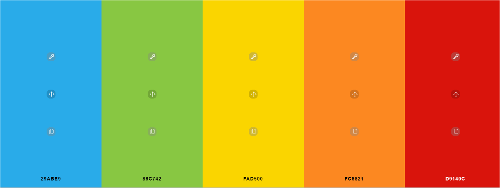

    <h1>
        
    </h1>
    <h2>
        Memory Blocks is an entertaining and challenging memory game that is suitable for all ages, 
        it can be played by anyone that can use a phone or any personal computing device!
    </h2>
    <h3><a href="https://johnny-morgan.github.io/memory-blocks/)">Click here</a> to view the site on GitHub pages.</h3>

## User Experience (UX) 

- ### User Stories

    As a player, I want:
 
    1. A game that will help sharpen my memory, so I can boost my memory performance in other areas of my life.
    2. A game that that has different levels of difficulty, so I can continue to challenge myself as my memory skills improve.
    3. To be able to keep track of my high score, so I can challenge myself to beat it.
    4. A challenging game, so I can feel a sense of achievement when I play well in the game.
    5. A game that I can play on all devices, so I can play it any time or place.
 
    As a young player, I want:

    1. A game that is simple and intuitive to play, so I do not need to spend too much time learning how to play the game.
    2. Easy controls for the game, so I can play the game comfortably and effortlessly.
    3. A game that is fun to play, so I can share and play with my family and friends.
    
    As an adult player or parent, I want:

    1. A game I can play with my children, so I can spend more time having fun with them.
    2. The ability to contact the developer of the game, so I can report any bugs or offer suggestions.
    3. Simple instructions for the game, so I can easily learn how to play the game and instruct younger children how to play. 

- ### Wireframes

  The wireframes for this project were created using Balsamiq.

  - [Homepage](https://github.com/Johnny-Morgan/memory-blocks/blob/master/assets/docs/wireframes_homepage.pdf).

  - [Gamepage](https://github.com/Johnny-Morgan/memory-blocks/blob/master/assets/docs/wireframes_gamepage.pdf).

  - [Instructions Modal](https://github.com/Johnny-Morgan/memory-blocks/blob/master/assets/docs/wireframes_instructions_modal.pdf).

  - [Contact Form Modal](https://github.com/Johnny-Morgan/memory-blocks/blob/master/assets/docs/wireframes_contact_form_modal.pdf).

- ### Design

  - #### Colour Scheme

    I used a "Stimulate The Brain" colour scheme for this project which I obtained from [schemecolor](https://www.schemecolor.com/stimulate-the-brain.php).
    This palette has 5 colors which are Button Blue (#29ABE9), Yellow-Green (#88C742), Cyber Yellow (#FAD500), Princeton Orange (#FC8821) and Venetian Red (#D9140C).
    
    

  - #### Typography

    [Salsa](https://fonts.google.com/specimen/Salsa?query=salsa&preview.text_type=custom#standard-styles) was chosen as the main font for this website with cursive as the fallback font.
    Salsa is a fun and elegant font which is appealing to both children and adults.

## Technologies Used

### Languages Used

- [HTML5](https://en.wikipedia.org/wiki/HTML5)

- [CSS3](https://en.wikipedia.org/wiki/Cascading_Style_Sheets)

- [JavaScript](https://www.javascript.com/)

### Frameworks, Libraries & Programs Used

- [jQuery](https://jquery.com/)

  - jQuery is used to simplify the JavaScript code and DOM manipulation. 

- [Bootstrap 4.5](https://getbootstrap.com/)

  - Bootstrap is used to assist with the responsiveness and styling of the website.

- [GitPod](https://gitpod.io)

  - GitPod was used as the IDE for this project.

- [Git](https://git-scm.com/)

  - Git is used for version control by utilizing the Gitpod terminal to commit to Git and Push to GitHub.

- [GitHub](https://github.com/)

  - GitHub is used to store the project's code after being pushed from Git.

- [Balsamiq](https://balsamiq.com/)

  - Balsamiq is used to create the wireframes during the design process.

- [Google Fonts](https://fonts.google.com/)

  - Google Fonts is used to obtain the Roboto Condensed font family.

- [Font Awesome](https://fontawesome.com/)

  - Font Awesome is used to obtain the icons used in the Contact Me section.

## Credits

### Code

- The title h1 style and animation was taken from [Kevin Powell's](https://www.youtube.com/watch?v=f3mwKLXpOLk&t=670s&ab_channel=KevinPowell) YouTube channel and edited.

- The JavaScript for the animated text was take from [tobiasahlin.com](https://tobiasahlin.com/moving-letters/#9).