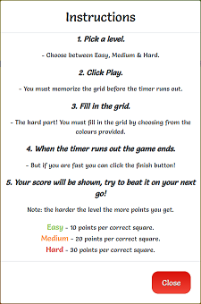

## Testing

### Testing Overview

- The website was tested on Google Chrome, Mozilla Firefox, Opera, Safari and Microsoft Edge browsers.

- Using Chrome developer tools the responsive nature of the site was tested on the Moto G4, Galaxy S5, iPhone5/SE, iPhone 6/7/8, iPad and Surface Duo.

- The website was tested on real-life devices, namely a 14" Windows laptop, an Alcatel 1 Android Phone and an iPhone SE.

### Validation

- The [W3C Markup Validator](https://validator.w3.org/#validate_by_input) service was used to validate the HTML code of the project.
  
- The [W3C CSS Validator](https://jigsaw.w3.org/css-validator/#validate_by_input) service was used to validate the CSS code. No errors were found.

- [JSHint](https://jshint.com/) was used to validate the JavaScript code of the project.

#### W3C Markup Validator results

- index.html

    - No errors were found. Two warnings were found - "The type attribute is unnecessary for JavaScript resources". This warning referred to the two scripts contained
    in the file. The code `type="text/javascript"` was deleted to remove this warning.

- game.html

    - No errors or warnings were found.

#### W3C CSS Validator results 

- The CSS passed with no errors.

#### JSHint Validation results

- Testing game.js

    - No major errors were found. Four warnings were produced, two were very minor and involved two missing semicolons which did not affect the running of 
    the program. The other two warnings stated that functions declared within loops referencing an outer scoped variable may lead to confusing semantics. 
    This referred to the variable activeColor and does not affect the running of the program. The functions could be refactored in subsequent updates.

- Testing utils.js

    - No major errors were found. Three warnings were produced, a semicolon was missing which was added and did not affect the running of the program. The 
    other two warnings stated that there was two undefined variables namely anime and emailjs. These were then declared inside the script to remove this warning. 
    The sendMail variable was declared as unused. This function is called in the form element of the index.html file.

### Testing User Stories from User Experience (UX) Section

- As a player, I want:
 
    1. A game that will help sharpen my memory, so I can boost my memory performance in other areas of my life.

        - Players of memory blocks are required to memorize the colour of between 9 and 25 squares in a grid depending 
        on the level they choose to play. The player also has to remember the colours within a certain time before the 
        countdown reaches zero. Keeping track of 9 items is a challenge in itself and so this game allows the player to 
        learn and practice skills such as the [mnemonic](https://en.wikipedia.org/wiki/Mnemonic) technique. Increasing your 
        short term memory helps in other areas of life such as remembering names and speeding up learning.

    2. A game that that has different levels of difficulty, so I can continue to challenge myself as my memory skills improve.

        - The game has three levels of difficulty, easy, medium and hard. Each jump in level significantly increases the difficulty of the game. 
        Moving from the easy level to medium level results in the amount of coloured squares that need to be remembered increasing from 9 to 16, 
        an increase in 78%. The jump to the hard level increases the cells to 25 which is a 56% increase on the medium level and motivates the player 
        to work harder on their memory skills.

        

         
        
        
        
        

    3. To be able to keep track of my high score, so I can challenge myself to beat it.

        - At the end of every game, the player's score is calculated and compared to the current highscore. If they beat the highscore a message is 
        dislpayed congratulating them on achieving a new highscore. Their highscore is displayed at the top of the game page and is stored in the 
        local storage on their device. Therefore when they return to the website at a later date their highscore is still available and 
        displayed for them.
        
        

         
          
        
        

          
    4. A game that I can play on all devices, so I can play it at any time or place.

        - Memory Blocks is a fully responsive website and can be played on all mobile phone devices as well as tablets, laptops and desktop computers.
 
- As a young player, I want:

    1. A game that is simple and intuitive to play, so I do not need to spend too much time learning how to play the game.

        - Memory Blocks is a very simple game to play, the goal of the game is to memorize a grid of coloured squares before a timer runs out. When 
        the timer reaches zero the coloured squares of the grid turn grey. Using their memory the player must then fill in the grid again. They simply
        choose a colour from the colour picker by clicking on it and then click on a square in the grid to fill that square with the chosen colour. The 
        game ends when the timer reaches zero. The player has the option to end the game before the timer runs out by clicking on the finish button. Messages
        are displayed a certain points during the game guiding the player on the relevant step to take such as memorizing the grid or filling in the grid.

        

         
        
        

    2. Easy controls for the game, so I can play the game comfortably and effortlessly.

        - The controls are easy to understand and implement. A series of click events are all that is required to play the game. The player simply clicks on the 
        relevant button to choose a level and clicks on the start button to play. To choose a colour they simply click on one of the coloured squares above the game grid. 
        The grid is filled in by clicking on the each square of the grid. The game is ended by clicking on the finish button or by letting the timer run down. A 
        show solution button can then be clicked to show the correct solution. They can then click the play again button to start a new game. There is no typing 
        needed during the game so the use of a keyboard is not required. 

    3. A game that is fun and exciting to play, so I can share and play with my family and friends.

        - At the end of each game the player receives a score for their effort. They can then compete with family members and friends to try and beat each others
        scores. A sense of competition brings entertaininment and it motivates players to outperform others and allows them to assess their performance against the
        performance of others. The vibrant colour scheme of the website adds energy and the countdown timer adds tension to the game as the counter approaches zero.
         
        

         
        
        

- As an adult player or parent/grandparent, I want:

    1. A game I can play with my children/grandchildren, so I can spend more time having fun with them.

        - Memory Blocks is suitable for all ages. By challenging each other to beat their scores, Memory Blocks allows parent/granparents to spend more fun time with 
        their children/grandchildren, all while developing and improving their memory skills.

    2. The ability to contact the developer of the game, so I can report any bugs or offer suggestions.

        - An email icon is provided on the home screen which when clicked opens a modal. The modal contains a contact form which the user can fill
        in to contact the site owner. A message is displayed on the home screen when the user fills out the form and sends it confirming whether or not the
        message was sent successfully.
        
        

         
        
        

    3. Simple instructions for the game, so I can easily learn how to play the game and instruct younger children how to play. 

        - A question mark icon is provided on the home screen which when clicked opens a modal. The modal contains a set of clear 
        and precise instructions on how to play the game.

        

         
        
        

### Manual Testing on Live Site

- Home page

  1. Hovered over the icons to verify the hover colour change worked as expected.
  2. Clicked on the question mark icon to verify it opened the instructions modal.
  3. Hovered over the close button in the instructions modal to verify the hover colour change worked as expected.
  4. Clicked on the close button in the instructions modal to verify it closed.
  5. Clicked outside of the instructions modal to verify it closed.
  6. Clicked on the email icon to verify it opened the contact form modal.
  7. Hovered over the close button in the contact form modal to verify the hover colour change worked as expected.
  8. Clicked on the close button in the contact form modal to verify it closed.
  9. Clicked outside of the contact form modal to verify it closed.
  10. Tried to submit the form with empty fields to verify a warning message appeared.
  11. Tried to submit the form with an invalid email address to verify a warning message appeared.
  12. Submitted the form to verify that a message sent successfully appeared on the homepage.
  13. Clicked on the play button to verify it redirected to the game page.

- Game page - pre-game stage

  1. Hovered over the easy, medium and hard buttons to verify the hover colour change worked as expected.
  2. Hovered over the back arrow to verify the hover colour change worked as expected.
  3. Clicked the back arrow button to verify it redirected to the home page.
  4. Clicked the easy button to verify the grid changed to a 3 x 3 grid.
  5. Clicked the medium button to verify the grid changed to a 4 x 4 grid.
  6. Clicked the hard button to verify the grid changed to a 5 x 5 grid.
  7. Verified that the message displayed below the buttons changed for the appropriate button.
  8. Verified that the play button appeared when each of the buttons was clicked.
  9. Hovered over the play button to verify the hover colour change worked as expected.

- Game page - memorizing time stage - easy game

  1. Clicked the play button with easy game chosen to verify that the grid was filled with random colours.
  2. Verified that the play button and level buttons were hidden.
  3. Verifired that the message "Memorize the grid..." displayed below the grid.
  4. Verified that the timer started at ten seconds and counted down to zero.
  5. Verified that the timer displayed "Go!" when it reached zero.
  6. Verified that the message "Fill in the grid" displayed when the timer reached zero.
  7. Verified that the Finish button displayed when the timer reached zero.
  8. Verified that each square of the grid turned grey when the timer reached zero.
  9. Verified the colour picker appeared above the grid when the timer reached zero.

- Game page - playing time stage- easy game

  1. Clicked on each of the colours of the colour picker to verify the border thickness of the clicked colour increased.
  2. Clicked on a square of the grid to verify its colour changed to that chosen in the colour picker.
  3. Repeated the above step for each of the colours.
  4. Verified that the timer started at 20 seconds and counted doewn to zero.
  5. Verified that when the timer reached 5 second the message displayed changed to "Hurry!".